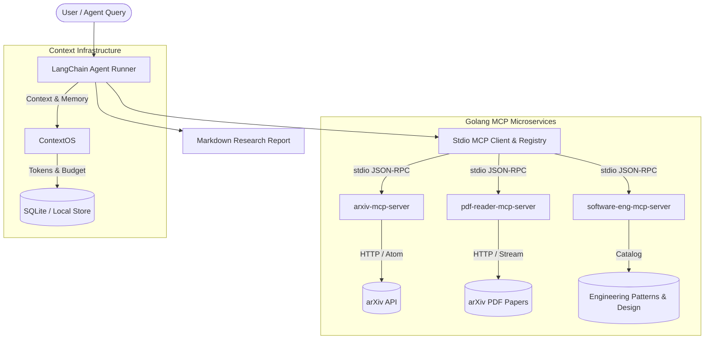

# langchain-mcp-researcher

An autonomous, multi-server research agent system combining **Golang Model Context Protocol (MCP)** microservices, **LangChain**, and **ContextOS** persistent context management.



---

## Architecture Overview

1. **`arxiv-mcp-server` (Go)**:
   - Exposes tools over standard MCP JSON-RPC 2.0 stdio transport.
   - `search_arxiv`: Search arXiv by keywords, category, sorting criteria, and pagination.
   - `get_arxiv_paper`: Fetch metadata, authors, and abstract for any arXiv ID.

2. **`pdf-reader-mcp-server-go` (Go)**:
   - Zero-dependency pure-Go PDF text reader and section extractor.
   - `read_pdf`: Read local PDF files with page limits.
   - `read_pdf_url`: Stream and parse academic PDFs directly from URLs (e.g., arXiv paper links).
   - `ExtractSections`: Automatically detects *Abstract*, *Introduction*, and *Conclusion* sections.

3. **`software-eng-mcp-server-go` (Go)**:
   - Curated engineering patterns and systems literature.
   - `search_swe_articles`: Search software engineering design documents and architectural articles.
   - `get_swe_pattern`: Deep dive into architectural trade-offs, implementation guidelines, and recommendations (`mcp`, `context-management`, `research-agent`).

4. **`langchain-agent` (Python)**:
   - Orchestrates the Go MCP microservices over stdio pipes.
   - Dynamic MCP tool discovery and binding.
   - Autonomous synthesis pipeline creating structured Markdown research reports with verified citations.

5. **ContextOS Integration (`bin/ctx`, `bin/contextd`)**:
   - Local-first, token-bounded context manager and IDE agent bridge.
   - Auto-configured for Antigravity IDE, Cursor, Claude Code, Codex, and Gemini CLI.

---

## Quickstart

### Prerequisites
- **Go**: 1.22+ or 1.24+
- **Python**: 3.10+
- **C Compiler**: Apple `clang` (macOS) or `gcc` (Linux)

### 1. Build All Go MCP Servers

Compile all servers into `bin/`:
```bash
make build-all
```

### 2. Run Test Suite

Run unit tests across all Go modules:
```bash
make test
```

### 3. Verify Agent Integration

Test tool discovery across all 3 Go MCP microservices:
```bash
make test-agent
```

### 4. Run a Research Query

Execute an autonomous research query:
```bash
cd langchain-agent
python3 agent_runner.py --query "Deterministic token allocation and context compaction in LLM agents"
```

Or run interactively:
```bash
python3 agent_runner.py
```

Generated reports are saved in `langchain-agent/reports/`.

---

## ContextOS CLI Commands

This repository includes ContextOS for context persistence:

```bash
# Check repository indexing status and node counts
./bin/ctx stats -repo .

# Re-index codebase symbols into ContextOS
./bin/ctx index -repo .

# Plan optimal context under a token budget
./bin/ctx plan -repo . -task "Improve PDF extraction caching" -budget 2500

# Record durable architectural decisions
./bin/ctx remember -repo . -kind decision -authority user -content "Use stdio MCP transport for zero-latency local tool calling"

# Resume latest session and active decisions
./bin/ctx resume -repo .
```

---

## MCP Server JSON-RPC Protocol Reference

All Go MCP servers communicate over stdio using standard JSON-RPC 2.0:

### Initialize Handshake
```json
{"jsonrpc": "2.0", "id": 1, "method": "initialize", "params": {"protocolVersion": "2024-11-05"}}
```

### List Tools
```json
{"jsonrpc": "2.0", "id": 2, "method": "tools/list", "params": {}}
```

### Call Tool
```json
{
  "jsonrpc": "2.0",
  "id": 3,
  "method": "tools/call",
  "params": {
    "name": "search_arxiv",
    "arguments": {
      "query": "transformer attention",
      "max_results": 3
    }
  }
}
```

---

## Repository Structure

```
├── Makefile                           # Unified build, test, and run orchestration
├── README.md                          # Repository documentation & architecture guide
├── go.work                            # Multi-module Go workspace
├── bin/                               # Compiled binaries & ContextOS CLI runtime
│   ├── arxiv-mcp-server
│   ├── pdf-reader-mcp-server
│   ├── software-eng-mcp-server
│   ├── ctx
│   ├── contextd
│   ├── ctx-hook
│   └── ctxbench
├── arxiv-mcp-server/                  # arXiv Atom API query & search MCP server
│   ├── client.go
│   ├── main.go
│   ├── main_test.go
│   └── go.mod
├── pdf-reader-mcp-server-go/          # PDF text extraction MCP server
│   ├── reader.go
│   ├── main.go
│   ├── reader_test.go
│   └── go.mod
├── software-eng-mcp-server-go/        # Software engineering patterns MCP server
│   ├── main.go
│   ├── main_test.go
│   ├── models/
│   │   └── topic.go
│   ├── readme.md
│   └── go.mod
├── langchain-agent/                   # Python research orchestrator
│   ├── agent_runner.py
│   ├── mcp_client.py
│   ├── config.yaml
│   ├── requirements.txt
│   ├── readme.md
│   └── reports/                       # Generated research syntheses
└── .agents/                           # Antigravity IDE MCP, rules, and hook configs
    ├── hooks.json
    ├── mcp_config.json
    ├── rules/contextos.md
    └── skills/contextos/SKILL.md
```